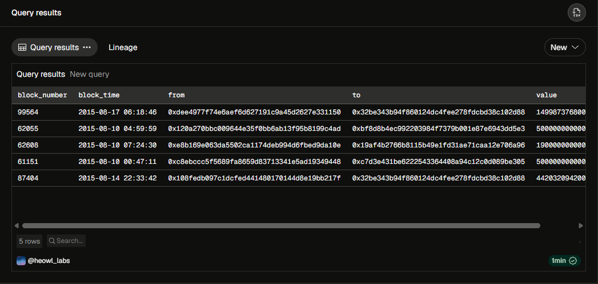

# Lesson 01-1: Data Representation Architecture: Centralized RDBMS vs. On-Chain Raw Ledgers

> 💡 **TL;DR**
>
> - **Fundamental Shift in Data Paradigm:** Understand the core differences between traditional Web2 databases (RDBMS like MySQL, PostgreSQL) and Web3 on-chain ledgers.
> - **State-driven vs. Event-driven:** Web2 databases are state-driven and mutable, meaning data can be updated or deleted (`UPDATE`, `DELETE`). Web3 ledgers are purely event-driven and immutable (Append-only); history cannot be altered.
> - **The Role of Dune Analytics:** Blockchain stores data as raw hexadecimals (e.g., `0x...`). Platforms like Dune Analytics act as an ETL (Extract, Transform, Load) bridge, decoding these unreadable bytes into relational tables querying via DuneSQL (Trino) so analysts can read them easily.
>
> _📁 File Name: `lesson_01_1_rdbms_vs_onchain.md`_

---

#### 1. Web2 Centralized RDBMS (Relational Database Management System)

기존의 은행이나 IT 기업이 사용하는 DB이다.

- State 중심적이고, 데이터의 UPDATE와 DELETE가 자유롭다.
- A가 B에게 10,000원을 송금하면, 은행의 DB는 다음과 같이 움직인다.
    1. A의 잔고 테이블에서 10,000원을 뺀다. (UPDATE)
    2. B의 잔고 테이블에서 10,000원을 더한다. (UPDATE)
- 분석가는 그저 `SELECT 잔고 FROM users WHERE 이름 = 'A'`라고 쿼리를 치면 현재 잔고를 바로 알 수 있다.

#### 2. Web3 Blockchain On-Chain Raw Ledger

이더리움과 같은 블록체인은 거대한 전 세계 공용 ‘영수증 뭉치’와 같다.

- Event 중심적이며, 한 번 기록된 데이터는 절대 UPDATE하거나 DELETE할 수 없다. (Immutable, Append-only)
  오직 새로운 데이터를 뒤에 이어 붙이는 INSERT만 가능.
- A 지갑에서 B지갑으로 1ETH를 송금하면, 블록체인에는 잔고가 업데이트되는 것이 아니라 “A가 B에게 1 ETH를 보냈다”라는 Transaction(영수증) 1장이 추가될 뿐이다.
- 온체인 DB에는 ‘현재 잔고’라는 개념을 곧바로 보여주는 원본 테이블이 없다. 잔고를 알려면 태초부터 지금까지 A가 받은 모든 Inflow를 더하고, A가 보낸 Outflow를 빼는 계산을 분석가가 직접 수행해야 한다.

#### 3. 데이터 표현 방식의 한계와 Dune Analytics의 역할

블록체인 Node에 저장된 실제 원본 데이터는 우리가 읽을 수 있는 형태가 아니다.
컴퓨터가 이해하기 쉬운 Hexadecimal byte code로 암호화 되어있다.

- ex) `0xa9059cbb000000000000000000000000...`

이런 데이터를 날것 그대로 분석하는 것은 불가능에 가깝다. Dune Analytics는 바로 이 문제를 해결해준다. Dune은 블록체인 네트워크에서 생성되는 이 난해한 16진수 영수증들을 실시간으로 가져와, 우리가 아는 Table형태로 예쁘게 변환한 뒤, DB에 적재해준다.

덕분에 우리는 복잡한 블록체인 암호학을 몰라도, 표준 SQL 언어(DuneSQL)만으로 블록체인 데이터를 쉽게 조회하고 분석할 수 있게 된다.

#### ⚠️ 실무 관점

- Mindset Shift: 온체인 분석가는 ‘현재 상태가 담긴 테이블이 어디있는지 찾는 사람’이 아니라, ‘어떤 이벤트 영수증들을 조합해야 현재 상태를 도출할 수 있을지를 고민하는 사람’이어야 한다.
- 블록체인 장부는 불변하기 때문에, 해킹을 당하든 실수를 하든 그 기록이 영원히 남는다. 따라서 온체인 데이터를 분석할 때는 실패한 트랜잭션(Reverted Tx)이나 스팸 데이터를 어떻게 잘 걸러낼 것인지 필터링하는것이 매우 중요하다. 이는 Lesson 03에서 자세히 다룰 예정이다.

#### 💻 실전 SQL Query

상세한 문법(_SELECT_, _FROM_, _LIMIT_)은 다음 `01-2`에서 본격적으로 다루고, 이번 레슨에는 *Dune Analytics*가 변환해준 온체인 장부가 실제로 어떻게 생겼는지 그 ‘형태’를 구경해 보는 차원에서 가장 기본적인 쿼리를 실행한다.

```sql
SELECT
	block_number,
	block_time,
	"from",
	"to",
	value
FROM
	ethereum.transactions
LIMIT 5;
```



---

#### Test

❓ 기존 중앙화 RDBMS와 블록체인 온체인 장부의 가장 큰 차이점 중 하나는 데이터의 ‘수정’ 가능여부입니다. 블록체인 데이터베이스가 가지는 불변성(Immutable)과 추가 전용(Append-only) 특성으로 인해, 특정 지갑 주소의 ‘현재 잔고’를 파악하려고 할 때 분석가는 원리적으로 어떤 방식을 거쳐야 하는지 서술해 보세요.

❗ 블록체인은 데이터의 UPDATE와 DELETE가 불가능한 Append-only 방식의 Event 장부이므로, ‘현재 잔고’라는 상태 값을 직접 담고 있는 단일 필드나 원본 테이블이 존재하지 않습니다. 따라서 분석가는 태초부터 해당 지갑 주소로 발생한 모든 자금의 유입(Inflow, ex: transactions 테이블의 to 혹은 토근 Transfer 이벤트의 to)을 합산하고, 나간 모든 자금의 유출(Outflow, from)을 산출하여 [총 유입액 - 총 유출액]의 집계 및 가감 연산을 직접 수행해야만 현재 잔고를 정확히 도출할 수 있습니다.
