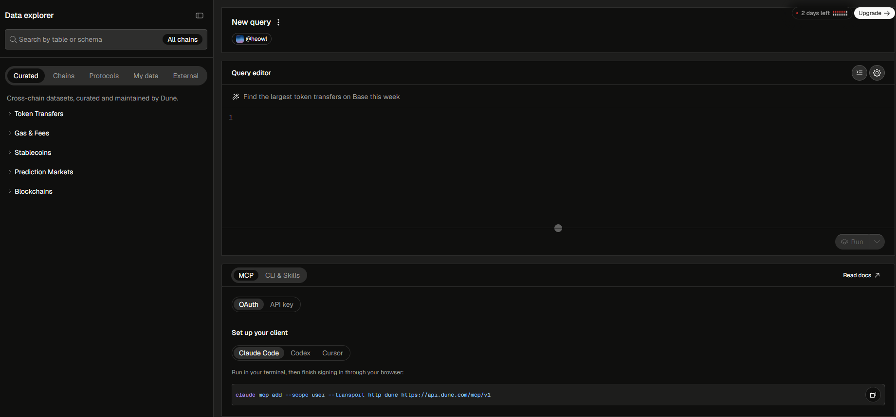
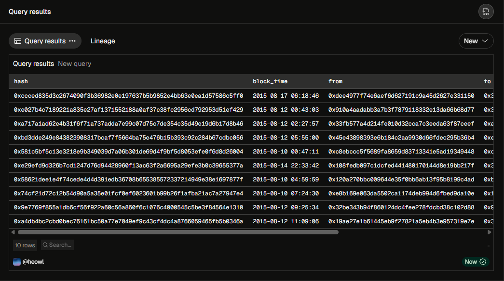

# Lesson 01-2: DuneSQL Environment Setup and Basic Syntax (SELECT, FROM, LIMIT)

> 💡 **TL;DR**
>
> - Dune Analytics UI Overview: The Dune workspace consists of the Schema Explorer (left), Query Editor (center), and Results Pane (bottom). Dune uses DuneSQL, a custom engine based on Trino.
> - `FROM` Clause (The Source): Specifies the exact table or dataset you want to query. In Web3, tables are often categorized by chains and event types (e.g., `ethereum.transactions`).
> - `SELECT` Clause (The Columns): Dictates which specific data points (columns) you want to extract from the source table. Using specific column names is vastly superior to using `SELECT *` for query performance.
> - `LIMIT` Clause (The Safety Net): Restricts the maximum number of rows returned by the query. In on-chain analysis where tables contain billions of rows, appending `LIMIT` during the exploration phase is an absolute necessity to prevent timeout errors and save computing credits.
> - Syntax Quirk (Reserved Keywords): In DuneSQL, words like `from` and `to` are reserved SQL keywords. To use them as column names, they must be wrapped in double quotes (e.g., `"from"`, `"to"`).
>
> _📁 File Name: `lesson_01_2_dunesql_setup_and_basic_syntax.md`_

---

#### 1. Dune Analytics 환경 세팅 및 UI의 이해

[_Dune Analytics(dune.com)_](https://www.dune.com)에 로그인한 후, 좌측 상단의 [+Create] → [Query] 순으로 이동하면 쿼리 에디터 창이 열린다. 화면은 크게 세부분으로 나뉜다.

- 좌측 (Schema Explorer): 우리가 쿼리할 수 있는 모든 블록체인 테이터베이스(테이블)의 목록이 있다. `ethereum`, `polygon`, `arbitrum` 등 체인별로 폴더가 나뉘어 있으며, 각 폴더 안에는 데이터들이 예쁘게 정리되어 있다.
- 중앙 (Query Editor): 실제로 SQL 코드를 작성하는 도화지이다. 우리가 앞으로 가장 많은 시간을 보낼 곳이다. 우측 하단의 ‘Run’ 버튼을 누르면 코드가 실행된다.
- 하단 (Results Pane): 코드를 실행한 결과물이 엑셀 표(Table) 형태로 출력되는 공간이다.



Dune Analytics Query 화면 (2026년 9월 기준)

#### 2. 데이터의 출처를 밝히다: `FROM`

SQL을 작성할 때 컴퓨터에게 가장 먼저 알려줘야 할 것은 “어떤 테이블에서 데이터를 가져올 것인가?”이며, 이 역할을 하는 것이 `FROM` 절이다.

- 온체인 장부에서 가장 기본이 되는 테이블은 이더리움 네트워크의 모든 송금 및 영수증 기록이 담긴 ethereum.transactions이다.
- 구문 구조: `FROM ethereum.transactions`

#### 3. 원하는 Column만 쏙쏙 골라내다: `SELECT`

테이블을 지정했다면, 그 테이블 안의 수 많은 데이터(Column)중 내가 보고 싶은 것만 선택해야 한다.

- `SELECT *`: \*를 쓰면 테이블의 모든 Column을 가 가져오라는 뜻으로, 온체인 데이터는 너무 방대하기에 실무에서는 절대 권장하지 않는다.
- 대신 우리가 보고 싶은 Column의 이름을 `,`로 구분하여 직접 적어주는 것이 좋다.
    - `hash`: 트랜잭션의 고유 아이디 (영수증 번호)
    - `block_number`: 이 거래가 기록된 블록의 번호
    - `block_time`: 거래가 발생한 시간
    - `"from"`: 돈을 보낸 사람의 지갑 주소
    - `"to"`: 돈을 받는 사람의 지갑 주소
    - `value`: 보낸 이더리움의 양 (Raw 단위)

#### 4. 온체인 분석가의 생명줄: `LIMIT`

`LIMIT`는 출력할 데이터의 ‘최대 Row 개수’를 제한하는 명령어이다.

- `ethereum.transactions` 테이블에는 현재 수십억 건의 영수증이 쌓여 있다. 만약 `LIMIT` 없이 전체 데이터를 조회하려고 하면 컴퓨터가 데이터를 불러오다 지쳐 뻗어버리거나(Timeout), Dune에서 제공하는 컴퓨팅 크레딧을 순식간에 다 써버릴 수 있다.
- 따라서 처음 보는 테이블의 구조를 파악할 때는 무조건 쿼리 맨 마지막에 `LIMIT 10`같은 값을 주어 안전하게 소량의 샘플 데이터만 확인하는 습관을 들여야 한다.

#### ⚠️ 실무 유의사항 및 꿀팁

예약어와 따옴표 처리: SQL 문법 자체에서 이미 사용 중인 단어들(예: `SELECT`, `FROM`, `WHERE` 등)을 ‘예약어’라고 부른다. 이더리움 데이터에는 돈을 보낸 주소와 받는 주소를 뜻하는 `from`과 `to`라는 컬럼이 있다. 이 단어들을 그냥 쓰면 컴퓨터가 SQL 문법으로 착각하여 에러가 발생한다.

- 컬럼명으로서의 `from`과 `to`를 사용할 때는 반드시 큰따옴표(`" "`) 로 감싸주어야 한다. (예: `"from"`, `"to"` 등)
- 작은따옴표(`' '`)는 문자열 데이터 자체(예: `'0x1234...'`)를 표현할 때 쓰므로 용도를 엄격히 구분해야 한다.

#### 💻 실전 SQL Query

```sql
SELECT
	hash,
	block_time,
	"from",
	"to",
	value
FROM ethereum.transactions
LIMIT 10;
```



---

#### TEST

❓ 우리는 방금 Dune Analytics 에디터에서 `ethereum.transactions` 테이블을 조회하는 쿼리를 배웠다. 만약 어떤 초보 분석가가 아래와 같이 쿼리를 작성하고 실행 버튼을 눌렀다면,

1. 문법적으로 어떤 부분에서 에러가 발생하며 그 이유는 무엇인가?
2. 온체인 데이터 환경을 고려했을 때 이 쿼리가 가진 치명적인 실무적 문제점은 무엇인가?

```sql
SELECT
	hash,
	from,
	to
FROM ethereum.transactions
```

❗

1. from과 to는 SQL 구문에서 예약어로 지정되어 있어, 감싸지 않고 사용할 경우 데이터베이스 엔진이 이를 식별자(컬럼명)가 아닌 문법 구조로 인식하여 구문 에러가 발생한다. 식별자임을 명시하기 위해 큰따옴표(`"from"`, `"to"`)로 감싸주어야 한다.
2. 수십억 건에 달하는 전체 데이터베이스 행(Row)을 제한 없이 한 번에 불러오려 하므로 쿼리 실행 시간 초과가 발생하거나, Dune Analytics의 컴퓨팅 크레딧을 순식간에 낭비하게 된다. 쿼리 맨 마지막에 `LIMIT 10` 또는 `LIMIT 100`을 추가하여 탐색 목적에 맞는 소량의 샘플 데이터만 출력하도록 제어해야 한다.
