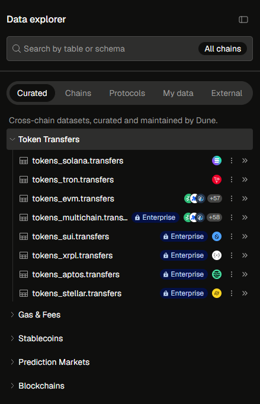
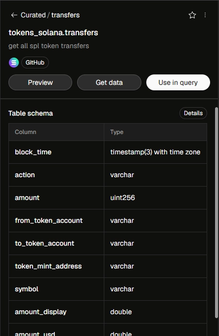
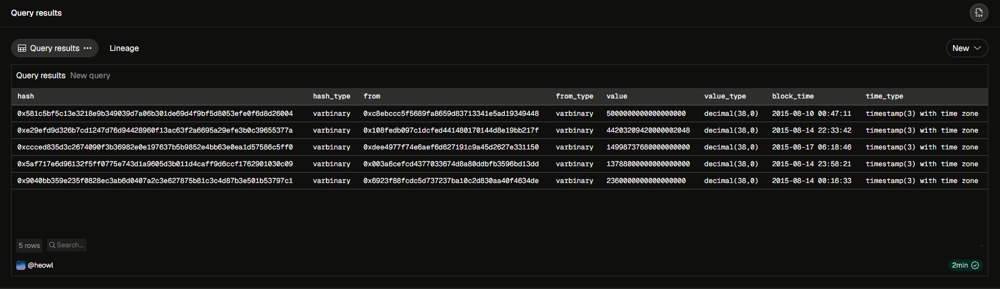

# Lesson 01-3: Categorical vs Numerical Columns and Data Type Identification

> 💡 **TL;DR**
>
> - **Data Anatomy:** On-chain data columns generally fall into two broad categories: Categorical (used for grouping/identifying) and Numerical (used for mathematical operations).
> - **Categorical Data:** Wallet addresses (`"from"`, `"to"`), transaction hashes (`hash`), and even block numbers (`block_number`) act as identifiers or categories. You group by these; you don't sum them.
> - **Numerical Data:** Values like transaction amounts (`value`) or gas prices are quantifiable. These are the columns you will aggregate using functions like `SUM()` or `AVG()`.
> - **DuneSQL Data Types:** Dune uses specific data types like `VARCHAR` (strings), `VARBINARY` (raw hex data like addresses/hashes), `BIGINT`/`UINT256` (huge numbers for crypto balances), and `TIMESTAMP` (dates).
> - **Type Verification:** You can visually check types in Dune's left Schema Explorer or use the `TYPEOF()` function within a query to confirm how the engine interprets a column.
>
> _📁 File Name: `lesson_01_3_categorical_vs_numerical_data_types.md`_

#### 1. Categorical Data

어떤 대상의 ‘특성’이나 ‘이름표’ 역할을 하는 데이터이다. 연산의 대상이 아니라, 데이터를 분류하고 그룹화하는 기준이 된다.

- `hash`: 트랜잭션 영수증 번호
- `"from"`, `"to"`: 지갑 주소 및 Smart contract 주소
- `block_number`: 숫자로 표기되지만, ‘몇 번째 블록인지’를 나타내는 고유 ID에 가깝다. 두 블록 번호를 더하는 것은 의미가 없다.
- DuneSQL Data Type: 주로 `VARCHAR` (문자열)이나 `VARBINARY` (16진수 바이트 원시 데이터) 형태로 저장된다.
    - 최근 DuneSQL에서는 이더리움 주소와 해시를 `VARBINARY`타입으로 처리하는 것이 표준이다.

#### 2. Numerical Data

크기나 양을 나타내며, 사칙연상 및 통계의 대상이 되는 데이터이다.

- `value`: 전송된 이더리움의 양
- `gas_price`: 가스비 단가
- 온체인 생태계는 소수점 18자리(Wei단위 등)를 기본으로 사용하기 때문에 숫자가 매우 크다. 일반적인 `INTEGER`로는 담을 수 없어, `BIGINT`, `UINT256`(256비트 부호 없는 정수), 혹은 `DOUBLE`을 주로 사용한다.
    - 단위 변환과 오버플로우 방지는 Lesson 04에서 다룰 예정.

#### 3. 데이터 타입 확인 방법

- UI를 통한 확인: Dune Analytics 좌측의 Schema Explorer에서 테이블 이름을 클릭하여 펼치면, 각 컬럼명 오른쪽에 회색 글씨로 타입이 명시되어 있다.
- SQL을 통한 확인: `TYPEOF()`함수를 통해 직접 출력해 볼 수 있다.
  <table>
  <tr>
  <td>
  
  </td>
  <td>
  
  </td>
  </tr>
  </table>

#### ⚠️

- `block_time`의 함정: 시간이 담긴 `block_time` 컬럼은 숫자로 보일 수 있지만, 통계학적으로는 연속형 데이터이면서 동시에 DuneSQL에서는 `TIMESTAMP`라는 아주 특별한 고유 타입을 가진다. 단순 덧셈이 불가하며, 시간 전용 함수를 써야 한다.
- 시각화의 기본: 나중에 대시보드를 만들 때, 차트의 X축에는 보통 시간이나 Categorical Data가 들어가고, Y축에는 Numerical Data가 들어간다는 점을 기억해 두면 좋다.

#### 💻 실전 SQL Query

```sql
SELECT
	hash,
	TYPEOF(hash) AS hash_type,
	"from",
	TYPEOF("from") AS from_type,
value,
	TYPEOF(value) AS value_type,
	block_time,
	TYPEOF(block_time) AS time_type
FROM ethereum.transactions
LIMIT 5;
```



---

#### TEST

❓

온체인 데이터 분석 시, 컬럼의 성격을 정확히 인지하는 것은 매우 중요하다. 만약 우리가 `ethereum.transactions` 테이블을 사용하여 쿼리를 작성할 때, `value`컬럼에 대해서는 평균을 구하는 `AVG(value)` 연산을 수행할 수 있지만, `"from"` 컬럼이나 `hash`컬럼에 대해 `AVG(hash)` 와 같은 연산을 수행하면 에러가 발생하거나 의미 없는 결과가 나온다. 그 이유를 데이터의 성격 및 데이터 타입에 관점에서 설명해 보세요.

<details>

<summary>❗</summary>

`value` 컬럼은 전송된 이더리움의 양을 나타내는 Numerical Data이자 숫자 타입이므로, `AVG()`와 같은 통계적 집계 연산이 가능하다. 반면, `"from"`과 `hash` 컬럼은 지갑 주소 및 영수증 ID를 나타내는 Categorical Data이자 문자/바이트 타입이다. 따라서 이들은 값을 더하거나 나누는 산술 연산의 대상이 아닌 식별자일 뿐이므로, `AVG()` 연산을 수행할 경우 타입 불일치 오류가 발생하거나 통계적으로 무의미한 결과가 나온다.

</details>
