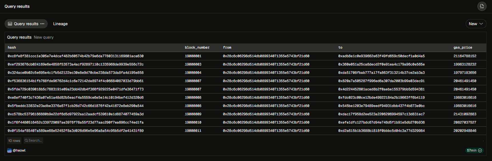

# Lesson 02-1: Conditional Filtering with Comparison and Logical Operators (WHERE, AND, OR, IN, BETWEEN)

> 💡 **TL;DR**
>
> - **The `WHERE` Clause:** The gatekeeper of your query. In the vast ocean of on-chain data, `WHERE` acts as a filter to extract only the rows that meet specific conditions, drastically reducing query execution time and computing costs.
> - **Comparison Operators:** Used to compare values (`=`, `!=` or `<>`, `<`, `>`, `<=`, `>=`). Crucial for pinpointing exact block numbers, specific transaction hashes, or transactions exceeding a certain size.
> - **Logical Operators (`AND`, `OR`, `NOT`):** Combine multiple conditions. `AND` requires all conditions to be true, `OR` requires at least one to be true, and `NOT` reverses the condition.
> - **List & Range Operators (`IN`, `BETWEEN`):** `IN (A, B, C)` is a cleaner alternative to multiple `OR` statements for checking a list of wallets. `BETWEEN X AND Y` is perfect for slicing data within a specific block or time range.
> - **Order of Operations:** `NOT` is evaluated first, then `AND`, then `OR`. Always use parentheses `()` when mixing `AND` and `OR` to explicitly control the logic and avoid disastrous data skews.
>
> _📁 File Name: `lesson_02_1_conditional_filtering_where_operators.md`_

이전 장에서 데이터를 가져오는(`FROM`) 방법과 원하는 열을 선택하는(`SELECT`) 방법을 배웠다.
하지만 블록체인에는 하루에도 수백만 건의 트랜잭션이 발생한다. 모든 데이터를 무작정 가져오면 분석이 불가능하다.

따라서 내가 원하는 특정 조건의 데이터만 건져내는 조건 필터링(`WHERE`)과 논리 연산자 문법을 다룬다.

#### 1. WHERE 절의 기본 위치와 비교 연산자

`WHERE` 절은 항상 `FROM` 절 바로 뒤에 위치한다. 데이터를 가져올 테이블을 지정한 후, 곧바로 필터링 망을 씌우는 구조.

- `=` (같다), `!=` 또는 `<>` (다르다)
    - 특정 지갑 주소나 특정 트랜잭션 해시를 정확히 짚어낼 떄 사용. (`"from" = '0x123...'`)
- `>`, `<`, `>=`, `<=` (크다, 작다 등)
    - 특정 블록 번호 이후의 거래를 보거나 이체 금액이 큰 ‘Whale’ 트랜잭션을 찾을 때 사용.

#### 2. 여러 조건을 결합하는 논리 연산자 (AND, OR, NOT)

현업 분석에서는 단 하나의 조건만으로 데이터를 찾는 경우는 드물다. “A 지갑이 보낸 거래 중에서 특정 블록 이후의 것”처럼 조건이 결합된다.

- `AND`: 앞뒤 조건이 모두 참이어야 데이터를 가져온다. 필터링이 깐깐해지므로 결과 집합(Row 수)이 줄어든다.
- `OR`: 앞뒤 조건 중 하나라도 참이면 데이터를 가져온다. 조건이 느슨해지므로 결과 집합이 늘어난다.
- `NOT`: 조건의 결과를 뒤집는다.

#### 3. 다중 필터링을 우아하게 만드는 IN과 BETWEEN

복잡한 논리 연산자를 깔끔하게 압축해 주는 강력한 도구.

- `IN(값1, 값2, …)`
    - ex) 해커의 지갑 주소 3개(A,B,C)에서 발생한 모든 거래를 찾고 싶습니다.
    - Bad Q: `WHERE "from" = 'A' OR "from" = 'B' OR "from" = 'C'`
    - Good Q: `WHERE "from" IN ('A', 'B', 'C')`
- `BETWEEN A AND B`
    - ex) 블록 번호 18,000,000부터 18,000,100 사이의 거래를 찾고 싶습니다.
    - Bad Q: `WHERE block_number >= 18000000 AND block_number <= 18000100`
    - Good Q: `WHERE block_number BETWEEN 18000000 AND 18000100`

#### 4. [심화] 논리 연산의 우선순위와 괄호 `()`의 마법

SQL 엔진은 연산자를 읽을 떄 나름의 우선순위를 가진다. `NOT` → `AND` → `OR` 순서로 계산.
`AND`와 `OR`를 섞어 쓸 때 괄호를 치지 않으면, 쿼리가 에러를 내지는 않지만 완전히 엉뚱한 데이터를 반환하는 침묵의 에러가 발생한다.
반드시 괄호를 사용하여 분석가의 의도를 SQL엔진에서 명확히 전달해야 한다.

#### ⚠️ 실무 유의사항 및 Tip

- 문자열 대소문자: 16진수 지갑 주소(`0x...`)를 검색할 떄, SQL은 기본적으로 작은 따옴표 안의 문자열을 대소문자 구분하여 엄격하게 비교한다. (Lesson 03-3에서 더 다룰 예정)
- Short-circuit Evaluation: `AND`로 여러 조건을 묶을 때, 가장 데이터를 많이 걸러낼 수 있는 조건을 제일 앞에 두는 것이 연산 리소스를 아끼는 데 유리하다. 엔진이 첫 조건에서 거짓을 발견하면 뒤의 조건은 아예 계산하지 않기 때문이다.

#### 💻 실전 SQL Query

```sql
SELECT
	hash,
	block_number,
	"from",
	"to",
	gas_price
FROM ethereum.transactions
WHERE
	block_number BETWEEN 19000000 AND 19000100
	AND
	(
		"from" IN
			from_hex('0xd8dA6BF26964aF9D7eEd9e03E53415D37aA96045'),
			from_hex('0x28C6c06298d514Db089934071355E5743bf21d60')
		)
		OR gas_price < 10000000000
	)
LIMIT 10;
```

01-3 강의에서 확인하였다 싶이 `"from"`의 Data Type은 `VARBINARY`(16진수 바이트 원시 데이터)이다. 즉, 일반적인 문자열 타입이 아니라는 뜻. 하지만, 쿼리의 주소 `'0xd8d...'`는 `VARCHAR`(문자열) 타입이다.

따라서, 지갑 주소를 비교할 때는 `from_hex()`함수를 써서 문자열을 `VARBINARY`로 변환해 주거나, `0x`리터럴을 사용해야 한다.

- **`0xd8dA6BF26964aF9D7eEd9e03E53415D37aA96045`**
  이더리움 창시자 비탈릭 부테린(Vitalik Buterin)의 공식 공개 지갑 주소(`vitalik.eth`).
- **`0x28C6c06298d514Db089934071355E5743bf21d60`**
  글로벌 대형 암호화폐 거래소 Binance의 Binance 14 주소.



---

#### TEST

❓

당신은 특정 에어드랍 이벤트를 분석하기 위해, “블록 번호 18,500,000 이후에 발생한 거래 중, 지갑 주소 A(`0xAAA...`)또는 지갑 주소 B(`0xBBB...`)가 수신자(to)인 거래”를 모두 찾으려고 합니다.

한 주니어 분석가가 아래와 같이 쿼리를 작성했습니다. 이 쿼리를 실행하면 에러는 발생하지 않지만, 당신이 의도한 결과와 전혀 다른 엄청난 양의 데이터가 쏟아져 나옵니다.

[주니어의 쿼리]

```sql
SELECT
	hash,
	block_number,
	"to"
FROM ethereum.transactions
WHERE block_number > 18500000
  AND "to" = from_hex('0xAAA...')
  OR "to" = from_hex('0xBBB...')
```

1. 이 쿼리의 논리적 결함을 연산자 우선순위 관점에서 설명하시오
2. 당신의 원래 의도대로 정확히 작동하도록 WHERE절을 두 가지 다른 방식으로 수정해 보세요.

<details>

<summary>❗</summary>

1. SQL에서 AND는 OR보다 우선순위가 높다. 따라서 위 쿼리는 `(block_number > 18500000 AND "to" = '0xAAA...') OR ("to" = '0xBBB...')`로 해석된다. 그 결과 지갑 B로 전송된 거래는 블록 번호 제약 조건을 완전히 무시하고 모든 과거 데이터가 전부 출력되어 결과(Row)가 쏟아지게 된다.
2. 괄호 사용, IN 연산자 사용

    ```sql
    WHERE block_number > 18500000
      AND ("to" = from_hex('0xAAA...') OR "to" = from_hex('0xBBB...'))

    WHERE block_number > 18500000
      AND "to" IN (from_hex('0xAAA...'), from_hex('0xBBB...'))
    ```

</details>
